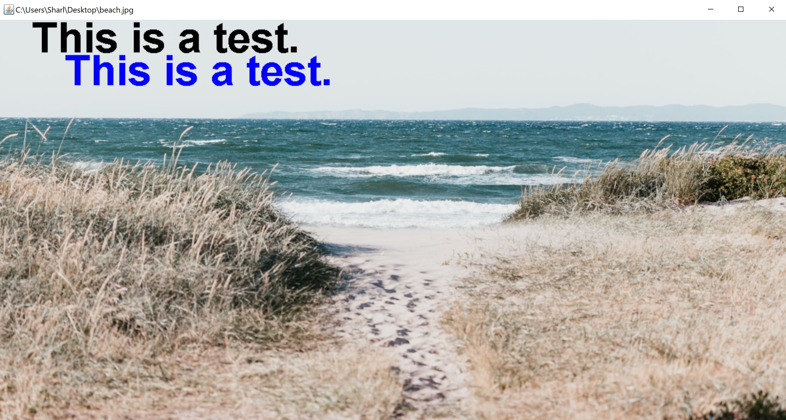

# JES-Text-on-Images
This is a simple script to add text onto images in JES

* How to Add Text 
* How to Add Styled Text

## Prerequisites 

* Make sure you have JES installed on your computer.

## To Run

* Open the JES Program.
* Click on File > open program and choose JES-Text/JESText.py
* Load the program
* Run the functions using the command line

## Example

